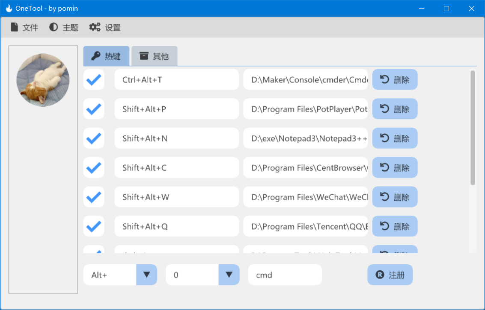
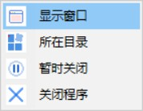

<!--
 * @Author: Pomin
 * @Date: 2022-01-11 11:09:39
 * @Github: https://github.com/POMIN-163
 * @LastEditTime: 2022-01-13 17:23:22
 * @Description:
-->
# OneTool —— 用 dear imgui 开发的一个小工具

## 全局热键

### 暗色调

### 亮色调

## 任务栏托盘

## JSON 配置文件

